# Previous Charities of the Month
These charities have been featured as a charity of the month since TheTrumpTicker.com's inception in February 2025. These charities are all highly recommended and would greatly appreciate your attention, your time, or your donation.

## February 2025
### [The Renaissance Youth Center](https://www.renaissanceyouth.org/)
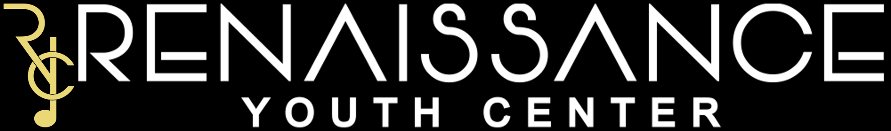
The Renaissance Youth Center, based in Bronx, New York, has created a safe haven for the community's youth to develop life-long academic and social skills. They offer music classes, afterschool programming, tutoring, and civic engagement while instilling the importance of self and community growth.

### [826LA](https://www.826la.org/)
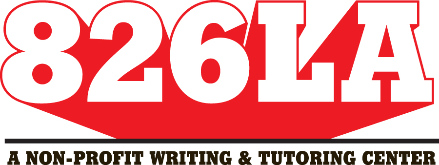
826LA is a Los Angeles-based nonprofit dedicated to supporting students aged 6-18. They focus on students' creative and expository writing skills and help teachers inspire their students to write with programs structured around one-on-one attention.

### [The California Community Foundation](https://calfund.org/)
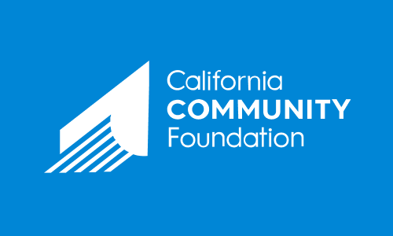
The California Community Foundation leads positive systemic change that strengthens Los Angeles' communities. Currently, they are dedicating resources to aid recovery efforts following the Palisades wildfires that have ravaged the region.

### [The National Women's Law Center](https://nwlc.org/)
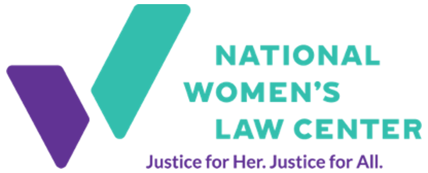
The National Women's Law Center, founded in 1972 in Washington, D.C., advocates for women's rights and LGBTQ rights through litigation, policy, and culture change initiatives.

## March 2025
### [New Door Ventures](https://www.newdoor.org/)
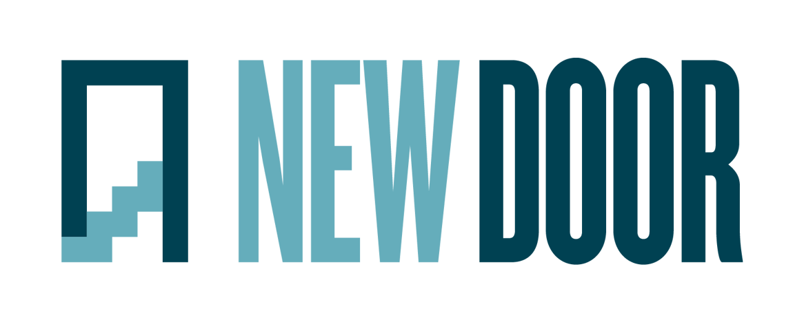
New Door Ventures helps at-risk youth get ready for work and life. Through real opportunities to work and learn, we provide assistance to young people ages 16-21 who need support in making the increasingly difficult transition to adulthood. We provide youth with the meaningful jobs and training that they need to succeed in the workplace, and the personal support they need for the rest of life. We offer a comprehensive approach to helping youth succeed through: jobs, job readiness, supportive community.

### [Gift of Adoption](https://giftofadoption.org/)
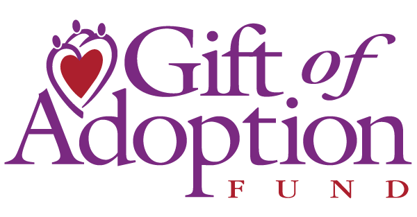
Established in 1996, the mission of Gift of Adoption is to provide grants to complete the adoptions of vulnerable children-giving them permanent families and a chance to thrive.

### [Center on Halsted](https://centeronhalsted.org/)

Center on Halsted advances community and secures the health and well-being of the LGBTQ people of Chicagoland and throughout the Midwest. Though Center on Halsted's building opened in 2007, our history goes back much further. We were known as Horizons Community Services, the Midwest's largest LGBTQ social service agency. We are proud of our legacy of advocacy, support, and educational services—the same services that helped form the core of Center on Halsted's programming.

### [Georgia Asylum and Immigration Network](https://georgiaasylum.org/)
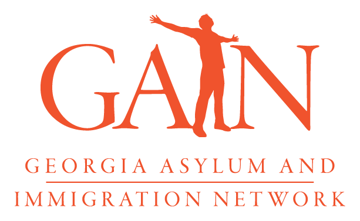
Georgia Asylum and Immigration Network (GAIN) is a 501(c)(3) organization that protects and empowers immigrant survivors of crime and persecution, including asylum-seekers and immigrant survivors of human trafficking, domestic violence, and sexual abuse. Our staff attorneys, paralegals, and navigators provide direct service to our clients while also building a volunteer force of attorneys, whom we recruit, train, and mentor. Through direct representation as well as our pro bono program which multiplies our impact, GAIN assists over 1,000 clients and family members each year.

## April 2025
### [The Association for Autism and Neurodiversity (AANE)](https://www.aane.org/)
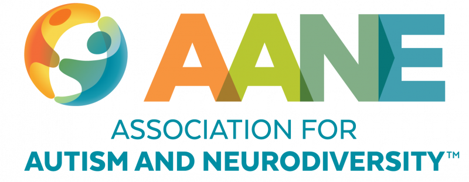
The Association for Autism and Neurodiversity (AANE) - formerly known as the Asperger/Autism Network - helps Autistic and similarly Neurodivergent people build meaningful, connected lives. We provide individuals, families, and professionals with education, community, and support, in an inclusive atmosphere of validation and respect.

### [Project Innerspace](https://projectinnerspace.org/)
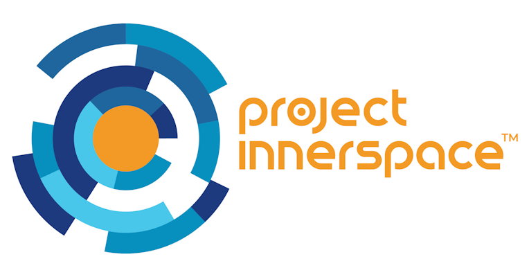
Project Innerspace aims to unlock global exponential growth of geothermal by facilitating the rapid transfer of resources, technologies, and know-how from the oil and gas industry toward geothermal energy production. We’re on a sprint to complete our mission by 2030. By the end of this decade – when our work is complete – geothermal energy development will be on an exponential roll with the oil and gas industry engaged on a worldwide scale.

### [Affirmations LGBTQ+ Community Center](https://goaffirmations.org/)
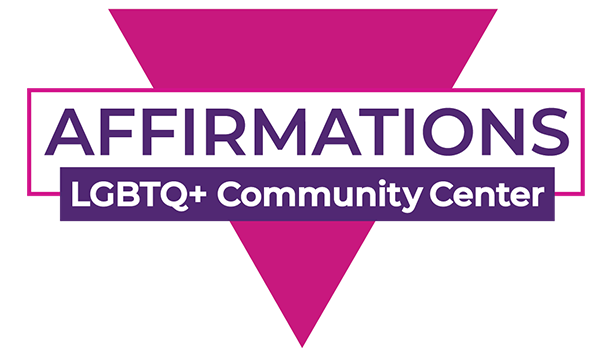
Affirmations LGBTQ+ Community Center was founded in 1989 with a mission to provide a welcoming space where people of all sexual orientations, gender identities and expressions, and cultures can find support and unconditional acceptance, and where they can learn, grow, socialize and feel safe.

### [Nova Ukraine](https://novaukraine.org/)
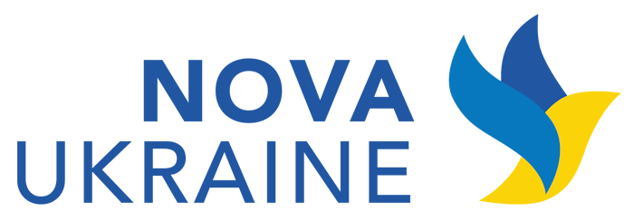
Nova Ukraine works diligently to provide humanitarian aid to vulnerable groups and individuals in Ukraine and to raise awareness about Ukraine in the US and throughout the world. We fully support Ukraine in its efforts to build a strong civil society, reform its educational system, and to eliminate corruption.

## May 2025
### [Ibis Reproductive Health](https://www.ibisreproductivehealth.org/)
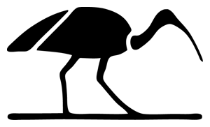
Ibis drives change through bold, rigorous research and principled partnerships that advance sexual and reproductive autonomy, choices, and health worldwide.

### [The Middle East Children's Alliance](https://mecaforpeace.org/)
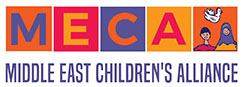
The Middle East Children’s Alliance (MECA) works to protect the rights and improve the lives of children in the Middle East through aid, empowerment and education. In the Middle East, MECA provides humanitarian aid, partners with community organizations to run projects for children, and supports income-generation projects. In the US and internationally, MECA raises awareness about the lives of children in the region and encourages meaningful action.

### [SAGE USA](https://sageusa.org/)

SAGE leads in addressing issues related to lesbian, gay, bisexual, transgender, queer and questioning and other self-identifying members of the community (LGBTQ+) aging. In partnership with its constituents and allies, SAGE works to achieve a high quality of life for LGBTQ+ older people, supports and advocates for their rights, fosters a greater understanding of aging in all communities, and promotes positive images of LGBTQ+ life in later years.

### [The Conservation Lands](https://conservationlands.org/)
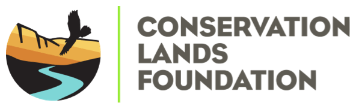
The Conservation Lands Foundation works to protect, restore, and expand the National Conservation Lands through education, advocacy, and partnerships. CLF is the only nonprofit in the country solely dedicated to this mission.

## June 2025
### [American Brain Foundation](https://americanbrainfoundation.org/')

The American Brain Foundation promotes and invests in research across the whole spectrum of brain disease. We believe that when we cure one of these diseases, we will cure many.

### [Blood:Water](https://bloodwater.org/)

Blood:Water is an international nonprofit that partners with African community-driven organizations to end health disparities caused by the HIV/AIDS and water crises.

### [PFLAG](https://pflag.org/)

PFLAG's mission is to create a caring, just, and affirming world for LGBTQ+ people and those who love them.

### [Western Environmental Law Center](https://westernlaw.org/)

The Western Environmental Law Center uses the power of the law to foster thriving, resilient western U.S. lands, waters, wildlife, and communities in the face of a changing climate.

## July 2025
### [HRI](https://hrionline.org/)

Human Rights Initiative of North Texas (HRI) provides legal and support services to refugees and immigrants who have suffered human rights abuses, advocates for justice and promotes international human rights.

### [Coalition for Humane Immigrant Rights (CHIRLA)](https://chirla.org/)

For more than 35 years, the Coalition for Humane Immigrant Rights (CHIRLA) has empowered immigrants to push policies that promote freedom of movement, full human rights, and the vigorous civic action that strengthens this democracy.

### [National Parks Conservation Association (NPCA)](https://npca.org/)

The mission of the National Parks Conservation Association (NPCA) is to protect and enhance America's National Parks for present and future generations.

### [Brady United](https://bradyunited.org/)

Brady is dedicated to creating an America free from gun violence, where all Americans are safe at home, at school, at work, and in their communities.

## August 2025
### [Organization for Autism Research](https://researchautism.org)
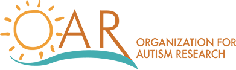
OAR's programs revolve around funding new research and disseminating evidence-based information.

### [Society of Hispanic Professional Engineers](https://www.shpe.org)
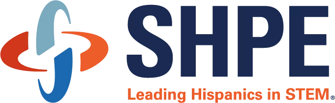
Society of Hispanic Professional Engineers changes lives by empowering the hispanic community to realize its fullest potential and to impact the world through STEM awareness, access, support, and development.

### [Latinitas](https://www.latinitasonline.org)
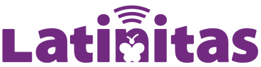
Latinitas is a 501c(3) organization focused on empowering girls and their communities through culturally relevant education.

### [Action Against Hunger](https://www.actionagainsthunger.org)

Action Against Hunger is a global humanitarian organization that takes decisive action against the causes and effects of hunger.
